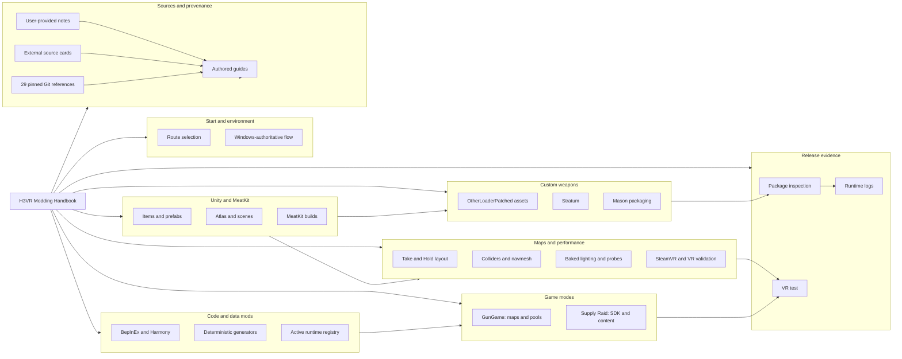

# H3VR Modding Handbook Topic Map

This map shows how the handbook subjects connect. Use it to build a mental
model or to spot a related concern; use [Handbook Navigation](index.md) when
you want a direct next link.

## Read the connections correctly

- **Unity and MeatKit** are common foundations; they are not replacements for
  a particular item, map, or game-mode workflow.
- **OLP, Stratum, and Mason** meet in a custom-item package, but each has a
  different responsibility: runtime loading, content structure, and package
  construction.
- **GunGame and Supply Raid** inherit map/content concerns, then add
  mode-specific registration and runtime acceptance checks.
- **Source records and pins** support every route with traceable evidence. They
  do not prove a current release or a successful runtime test on their own.
