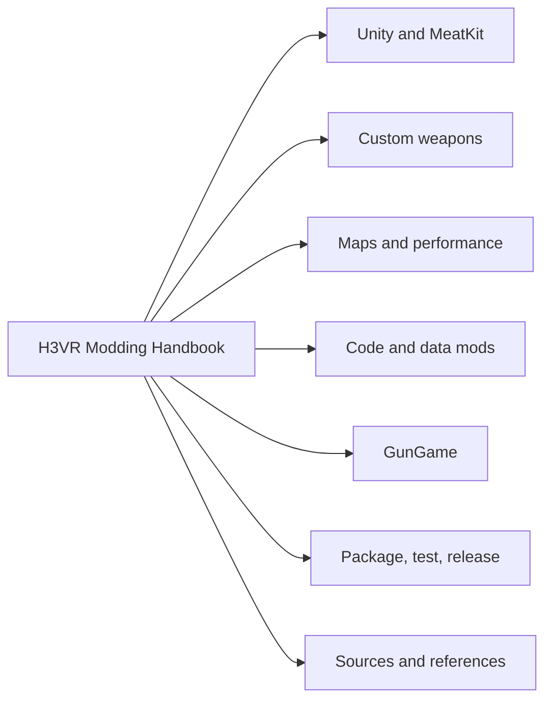

# H3VR Modding Handbook Foundation Implementation Plan

> **For agentic workers:** REQUIRED SUB-SKILL: Use superpowers:executing-plans to implement this plan task-by-task. Steps use checkbox (`- [x]`) syntax for tracking.

**Goal:** Build and publish a private H3VR modding handbook with pinned source references, direct documentation routes, and a visual index.

**Architecture:** This repository is a Git superproject. Upstream GitHub sources are pinned below `references/`; authored guides and source records live below `docs/`. A Python standard-library verifier checks the source manifest, submodules, and navigation links without touching the Windows H3VR runtime.

**Tech Stack:** Git submodules, GitHub CLI, Markdown, Mermaid, Python 3 standard library, and `unittest`.

## Global Constraints

- Work on `agent/handbook-foundation`, then fast-forward `main` only after verification.
- Preserve the existing 22 reference clones; never reset, clean, or reclone them.
- Windows H3VR-Mods and MeatKit-Lite remain authoritative for Unity, build, package, deployment, logs, and VR testing.
- Register exactly 27 required GitHub sources as submodules; pin Supply Raid at `SRE-1.3.0` and retain both OtherLoader remotes.
- User-provided text is raw Markdown. Third-party text is raw only through Git source or explicit redistribution permission; otherwise use an attributed source card.
- Do not include game binaries, Unity caches, profile data, credentials, or release artifacts.

---

## File Structure

| Path | Responsibility |
| --- | --- |
| `README.md`, `SOURCES.md` | onboarding, maintenance rules, and source-rights policy |
| `references/manifest.json` | required path, remote URL, and requested ref for every submodule |
| `scripts/verify_handbook.py` | validates manifest, Git submodules, and Markdown navigation links |
| `tests/test_reference_manifest.py` | asserts reference count, uniqueness, and required special sources |
| `docs/start-here.md`, `docs/development-flow.md` | route selector and Windows/macOS boundary |
| `docs/maps/`, `docs/weapons/`, `docs/gungame/` | focused authored guides |
| `docs/sources/` | raw user-provided notes and attributed external source cards |
| `docs/navigation/index.md`, `docs/navigation/mind-map.md` | text index and Mermaid graph |

### Task 1: Create handbook metadata and the source manifest

**Files:**
- Create: `.gitignore`, `SOURCES.md`, `references/manifest.json`, `tests/test_reference_manifest.py`
- Modify: `README.md`

**Interfaces:** `references/manifest.json` has a top-level `submodules` array. Each element has string keys `path`, `url`, and `requestedRef`.

- [x] **Step 1: Write the failing manifest test**

```python
import json
import unittest
from pathlib import Path

class ReferenceManifestTests(unittest.TestCase):
    def test_manifest_has_27_unique_sources(self):
        sources = json.loads(Path("references/manifest.json").read_text())["submodules"]
        self.assertEqual(27, len(sources))
        self.assertEqual(27, len({item["path"] for item in sources}))
        self.assertEqual(27, len({item["url"] for item in sources}))

if __name__ == "__main__":
    unittest.main()
```

- [x] **Step 2: Run the test before the manifest exists**

Run: `python3 -m unittest tests/test_reference_manifest.py -v`

Expected: `FileNotFoundError` for `references/manifest.json`.

- [x] **Step 3: Create the manifest and top-level documents**

Create a private-reference README with `git clone --recurse-submodules`, a `SOURCES.md` defining source classes, and a `.gitignore` limited to macOS/Python noise. Use the exact 27 source paths and URLs in the approved design spec. Use `SRE-1.3.0` as the Supply Raid requested ref and `default` for every other source.

- [x] **Step 4: Run the test and commit**

Run: `python3 -m unittest tests/test_reference_manifest.py -v`

Expected: one passing test.

```bash
git add .gitignore README.md SOURCES.md references/manifest.json tests/test_reference_manifest.py
git commit -m "docs: establish handbook source manifest"
```

### Task 2: Register the complete submodule library

**Files:**
- Move: `Packer/` → `references/Packer/`
- Move: `cityrobo/` → `references/cityrobo/`
- Move: `H3VR-Modding/` → `references/H3VR-Modding/`
- Create: `.gitmodules` and the five missing reference checkouts

**Interfaces:** Reads `references/manifest.json`; produces all 27 paths as initialized submodules at pinned commits.

- [x] **Step 1: Validate the existing 22 clones before moving them**

Run `git -C <clone> status --porcelain` and `git -C <clone> remote get-url origin` for every existing clone.

Expected: all status commands are empty and each normalized origin matches its manifest URL.

- [x] **Step 2: Move the owner directories and register the existing clones in place**

Run:

```bash
mkdir -p references
mv Packer cityrobo H3VR-Modding references/
```

For every moved manifest entry, run `git submodule add --force --name <unique-name> <url> <path>`. Before registering Supply Raid, run `git -C references/Packer/H3VR-Supply-Raid-SRE-1.3.0 describe --exact-match --tags` and require `SRE-1.3.0`.

- [x] **Step 3: Add missing sources**

Run `git submodule add --depth 1` for devyndamonster/OtherLoader, KacperObara/H3VR-GunGame, KacperObara/H3VR-GunGame.wiki, Nolenz/WurstMod, and Josh015/Alloy. Do not enable LFS smudging.

- [x] **Step 4: Check and commit the gitlinks**

Run: `git submodule status --recursive && git diff --check`

Expected: 27 initialized entries with no leading `-` or `+` marker.

```bash
git add .gitmodules references
git commit -m "chore: add H3VR modding references"
```

### Task 3: Add raw source records and attributable external references

**Files:**
- Create: `docs/sources/user-provided/2026-07-10-prometheus-map-modding-notes.md`
- Create: `docs/sources/user-provided/2026-07-10-custom-weapons-stratum-mason.md`
- Create: `docs/sources/user-provided/2026-07-10-gungame-notes.md`
- Create: `docs/sources/external/collected-resources.md`
- Create: `docs/sources/external/textmesh-pro-unity-5-6.md`
- Create: `docs/sources/external/ftw-arms-custom-weapons.md`

**Interfaces:** Each source document begins with `Source:`, `Provided by:`, `Captured:`, and `Redistribution:`. Raw user files retain the supplied notes; external cards contain URLs and short original summaries, not copied third-party prose.

- [x] **Step 1: Preserve user-provided source material verbatim**

Write the collected Prometheus map notes, hierarchy/performance topics, resource list, custom weapon/Stratum/Mason explanation, GunGame description, and all supplied URLs into the three user-provided Markdown files.

- [x] **Step 2: Create source cards for every linked external resource**

Index TextMesh Pro, WurstMod, BepInEx, SteamVR frame timing, Alloy, lighting resources, Mason, OtherLoader, GunGame, the three custom-weapon Google Docs, and the GunGame weapon-pool Google Doc. Record incomplete ManlyMarco and FTW references exactly as supplied; state that no direct FTW tutorial URL was verified.

- [x] **Step 3: Validate source headers and commit**

Run: `for f in docs/sources/**/*.md; do for header in 'Source:' 'Provided by:' 'Captured:' 'Redistribution:'; do rg -q "^$header" "$f" || exit 1; done; done; git diff --check`

Expected: every source file has all four metadata fields and the whitespace check passes.

```bash
git add docs/sources
git commit -m "docs: archive modding source material"
```

### Task 4: Write the practical handbook routes

**Files:**
- Create: `docs/start-here.md`, `docs/development-flow.md`
- Create: `docs/maps/overview.md`, `docs/maps/performance-and-vr-testing.md`
- Create: `docs/weapons/custom-weapons-stratum-mason.md`
- Create: `docs/gungame/overview.md`, `docs/gungame/map-authoring.md`, `docs/gungame/weapon-pools.md`

**Interfaces:** Every guide contains `## Use this route when`, an ordered checklist, and `## Primary references` pointing to source cards or raw Git documentation.

- [x] **Step 1: Write start and development-flow guidance**

Route Unity items, maps, BepInEx/Harmony code, data generators, and GunGame work to the appropriate guide. State that all implementation, build, packaging, deployment, log review, and VR validation happen in the Windows-authoritative workspaces.

- [x] **Step 2: Write maps and performance guides**

Organize the supplied Prometheus material into hierarchy, Take & Hold setup, colliders, PMat, lighting, reflection/light probes, occlusion, navmesh, audio, custom scripts, profiling, and VR testing.

- [x] **Step 3: Write the weapons and GunGame guides**

Separate Unity implementation, OtherLoader on-demand assets, and Mason/Stratum packaging. Require a named tool version because the maintained wiki labels its packaging links legacy. For GunGame, separate map work from deterministic weapon-pool generation and require live-registry validation on Windows.

- [x] **Step 4: Validate guide structure and commit**

Run: `for f in docs/start-here.md docs/development-flow.md docs/maps/*.md docs/weapons/*.md docs/gungame/*.md; do rg -q '^## Primary references' "$f" || exit 1; done`

Expected: command exits `0`.

```bash
git add docs/start-here.md docs/development-flow.md docs/maps docs/weapons docs/gungame
git commit -m "docs: add H3VR modding routes"
```

### Task 5: Build the route index and mind map

**Files:**
- Create: `docs/navigation/index.md`
- Create: `docs/navigation/mind-map.md`

**Interfaces:** The index has direct links for every route and reference owner. The graph is a GitHub-renderable Mermaid `flowchart LR` rooted at `H3VR Modding Handbook`.

- [x] **Step 1: Write the text-first index**

Group direct relative links under Start, Unity/MeatKit, Weapons, Maps, Code/Data, GunGame, Release, Sources, and Reference Repositories.

- [x] **Step 2: Write the Mermaid graph**

Use this required root and branches, then connect each to its guide and primary reference category:



- [x] **Step 3: Commit the navigation documents**

Run: `git diff --check && git add docs/navigation && git commit -m "docs: add handbook navigation map"`

Expected: Git records the index and graph with no whitespace errors.

### Task 6: Implement the verifier and publish the private repository

**Files:**
- Create: `scripts/verify_handbook.py`
- Modify: `tests/test_reference_manifest.py`

**Interfaces:** `python3 scripts/verify_handbook.py [--links-only]` exits `0` only when the 27-entry manifest, `.gitmodules`, clean initialized submodules, and index relative links agree.

- [x] **Step 1: Extend tests for required special sources**

Assert that the manifest contains `SRE-1.3.0`, both OtherLoader paths, `H3VR-GunGame.wiki`, `Nolenz/WurstMod`, and `Josh015/Alloy`.

- [x] **Step 2: Implement the verifier**

Implement `load_manifest()`, `load_gitmodules()`, `verify_manifest()`, `verify_submodules()`, and `verify_navigation_links()` using only `json`, `pathlib`, `subprocess`, `re`, and `argparse`. Normalize only a terminal `.git` when comparing remotes; collect all errors before returning non-zero; never fetch network resources.

- [x] **Step 3: Run verification and commit**

```bash
python3 -m unittest tests/test_reference_manifest.py -v
python3 scripts/verify_handbook.py --links-only
python3 scripts/verify_handbook.py
git diff --check
git add scripts/verify_handbook.py tests/test_reference_manifest.py
git commit -m "test: verify handbook references"
```

Expected: all verification commands exit `0`.

- [x] **Step 4: Fast-forward and publish**

```bash
git switch main
git merge --ff-only agent/handbook-foundation
gh repo create h3vr-modding/H3VR-modding-handbook --private --source=. --remote=origin
git push -u origin main
gh repo view h3vr-modding/H3VR-modding-handbook --json nameWithOwner,isPrivate,defaultBranchRef
```

Expected: private `h3vr-modding/H3VR-modding-handbook` has `main` at the verified local commit.
